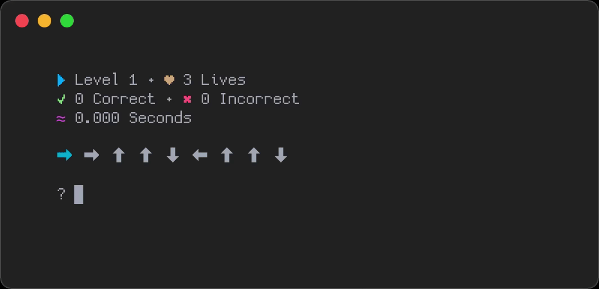

# hjkl
> 💃 DDR, but with Vi keys.

## Installation
- macOS
```
brew install strafe/tap/hjkl
```

- Linux
	- You know what you're doing :penguin:.

## Usage
```
Usage: $program [OPTIONS]
DDR, but with Vi keys.

Options:
        -h, --help      Output a help message.
        -v, --version   Output the current version.
        -k, --keys      Amount of keys per level (minimum of 1).
        -l, --lives     Amount of lives before game over (0 for infinite).
```
<center></center>

## License
[MIT](LICENSE)